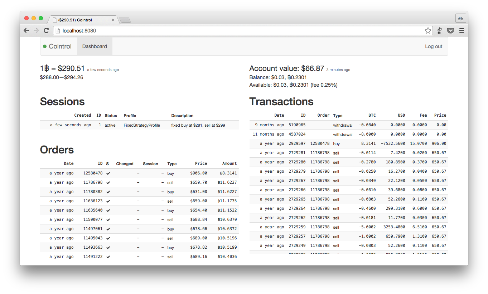
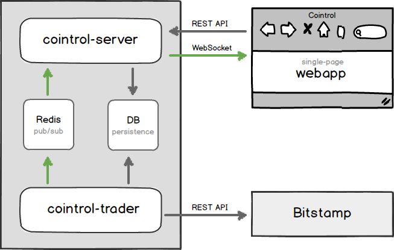

# Cointrol

Cointrol is a Bitcoin trading bot and real-time dashboard for [Bitstamp](https://bitstamp.net).



Cointrol was created to automate Bitcoin speculation. Besides automated trading based on price change triggers and various trading strategies, it also provides a dashboard for your Bitstamp account where you can see all your orders and transactions real-time updated (something Bitstamp lacks).

Even though the original idea was to perhaps provide a fully-fledged hosted service, the system remained quite basic as it has only been used by its creator for a period of time in the winter of '13/'14 (when BTC price fluctuations were pretty insane). Some of the obvious limitations—all of which could easily be addressed—are:

* Only basic trading strategies are implemented
* Single user/Bitstamp account is supported
* Only one active trading session at a time
* The whole account value is used when trading
* Django admin is used for auth and trading strategy/session manipulations

Even though Cointrol has been used for real transactions, no guarantees are provided in terms of security, correctness, etc. (see `LICENCE`).


## Architecture

The system consists of the following components:




####`cointrol-trader`

* Polls various Bitstamp API endpoints
* Writes changes to DB
* Publishes changes to Redis pub/sub
* Opens orders, when suitable


###`cointrol-server`

* Serves Webapp static files
* Exposes DB for Webapp via a REST API
* Forwards Redis pub/sub messages from Trader to Webapp via WebSocket
* Exposes Django administration that is currently used for managing trading sessions


### `webapp`

* REST/WebSocket API-powered Single Page App
* Real-time updated overview on orders, transactions, and trading sessions


## Technology

**The server-side parts** (`cointrol-server` + `cointrol-trader`) are written in **Python 3** (3.3+ is required) and use a mixture of **Django** (models, admin) and **Tornado** (WebSockets, async IO). Other libraries that are used include sockjs-tornado, Django REST framework.

**The single-page webapp** is written in CoffeeScript, Sass, Handlebars and uses Backbone.js, Brunch, socksjs-client, Bootstrap.


## Installation


### Prerequisites

* Python 3.3+
* Redis


### Install Cointrol

#### Server
```bash
mkdir Cointrol && cd Cointrol

# Create an isolated virtual environment
pip install virtualenv
virtualenv ./virtualenv --python=$(which python3)

# Activate the virtualenv
# IMPORTANT: it needs to be activated everytime before you run
#            a manage.py or cointrol-* command.
. virtualenv/bin/activate

git clone git@github.com:jakubroztocil/cointrol.git

echo 'from .settings_dev import *' > cointrol/cointrol/conf/settings_local.py

pip install -r cointrol/cointrol/conf/requirements.txt
pip install -e ./cointrol

cointrol/manage.py syncdb --noinput
```

#### Web client

Development setup — only needed if you plan on making changes to the single-page webapp.

```bash
# Install dependencies
sudo npm -g install bower
cd cointrol/webapp
npm install
bower install

# Watch source files
brunch watch
```

### Create user

```bash
. virtualenv/bin/activate
cointrol/manage.py createsuperuser
```


### Configure Bitstamp API access

1. Go to [https://www.bitstamp.net/account/security/api](https://www.bitstamp.net/account/security/api) to get you API key/secret
2. Activate the virtualenv and run `cointrol-server`
3. Go to [http://localhost:8000/admin/core/account/1/](http://localhost:8000/admin/core/account/1/) and enter your Bitstamp account details

## Usage

### Start the sever


```bash
. virtualenv/bin/activate
cointrol-server
```


By default, it will run on [http://localhost:8000](localhost:8000). You can change the port with `--port=<port>`.

The Django administration interface is used for log-in — just go back to `/` after you've done that.

### Start the updater/trader

```bash
. virtualenv/bin/activate
cointrol-trader
```


### Trading

1. Through the admin ([http://localhost:8000/admin/](http://localhost:8000/admin/)) you can create a trading strategy profile. It can be for the *fixed* (fixed price points in USD are used as buy/sell triggers) or the *relative* (percentage of the initial BTC price are used) strategy.
2. Create a trading session (also in the admin interface).
3. To perform actual transactions, you'll have to enable them in the settings (we used the `settings_dev` module which disables them). Add `COINTROL_DO_TRADE = True` to your `cointrol/cointrol/conf/settings_local.py`.


## Settings

The settings is resolved in this order: 

1. `settings_local.py`
2. `settings_(prod|dev).py` 
3. `settings_defaults.py`
4.  Django defaults

During the installation process, you've created `cointrol/cointrol/conf/settings_local.py` which imports settings from the `settings_dev.py` file. All the settings are [Django settings](https://docs.djangoproject.com/en/1.7/ref/settings/). The only non-Django settings is `COINTROL_DO_TRADE` (`False` in `dev`, `True` in `prod`). You can override any of the default settings in the `settings_local.py` file.

Besides `settings_dev.py`, the `conf` directory also has `settings_prod.py`, which is more suitable for production use. It defines logging configuration which makes messages of a level `>=` `WARNING` logged by the trader to be sent to you via email (e.g. when the trader places an order or there is an error). If you decide to use this settings file (by changing the import in `settings_local.py` to `from .settings_prod import *`, you'll have to configure at least [`DATABASES`](https://docs.djangoproject.com/en/1.7/ref/settings/#databases), [`ADMINS`](https://docs.djangoproject.com/en/1.7/ref/settings/#admins) and [`SECRET_KEY`](https://docs.djangoproject.com/en/1.7/ref/settings/#secret-key) as well in your in `settings_local.py`.


## Contact

Jakub Roztocil

* [https://github.com/jakubroztocil](https://github.com/jakubroztocil)
* [https://twitter.com/jakubroztocil](https://twitter.com/jakubroztocil)
* `3NVcdcoXrBV7jKv7T3st6kQz7XdsPNUn34`

## Licence

MIT. See [LICENCE](./LICENCE).


